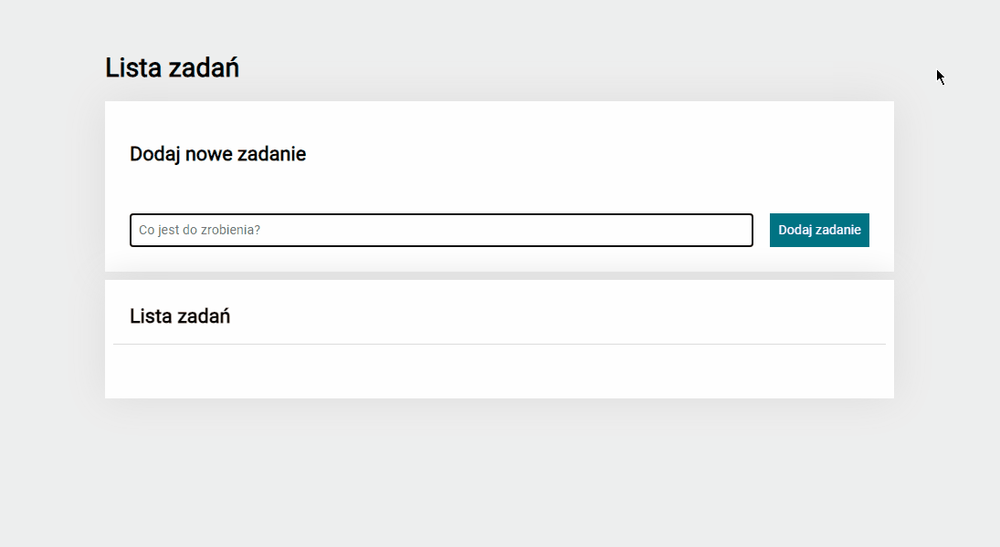

# To do list

Hello!

In this repository I want to show you *to do list*. You can make here your own list important things to take care. If task is done you can tap in green button – task will be crossed out and in green button apear „✔”. You can also delate task tapping in red button. Additionally you can click in "Ukończ wszystkie" button to mark all tasks done or "Ukryj ukończone" button to hide all done tasks. 

## Demo

https://gabriela444.github.io/to-do-list/

## Used:  
- HTML  
- CSS  
- JavaScript  
- BEM convention
- Grid
- Flex
- Media queries
- Immutability